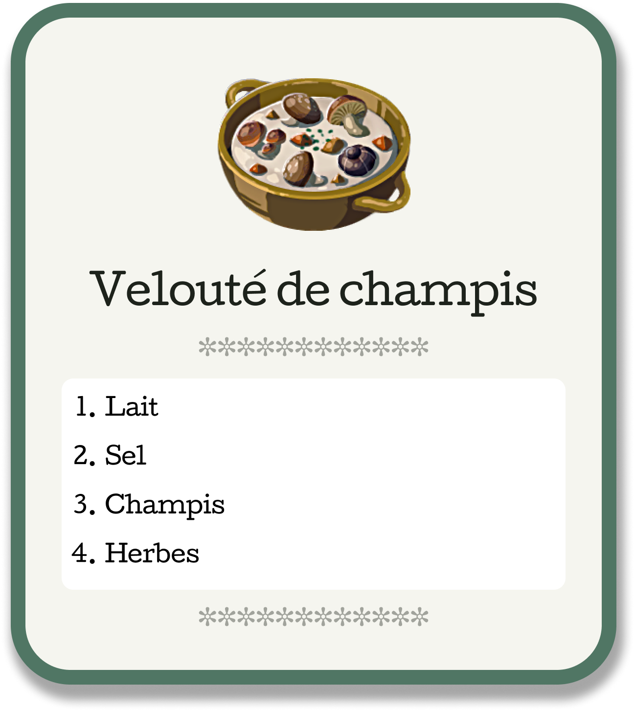

# Exercice Recette de cuisine

## Objectif

Créer le visuel d'une "carte" de recette de cuisine sur Figma et la reproduire en HTML/CSS.

## Consignes

- Créer un nouveau fichier Figma
- Créer une "carte" de recette de cuisine, soyez créatif·ve!
- Reproduire la carte en HTML+CSS le plus fidèlement possible
- 🏎️ Ajouter un effet au survol de la carte (quand le curseur passe au-dessus de la carte)
- 🏎️ Optimiser votre code de manière à pouvoir créer une deuxième recette dans le fichier HTML sans avoir à ajouter de CSS

## Exemple

